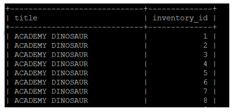
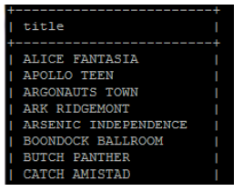
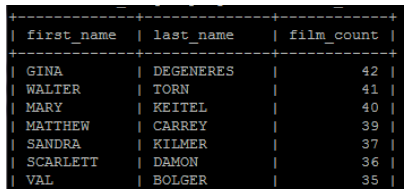
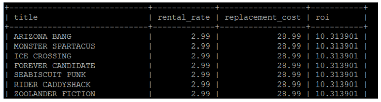
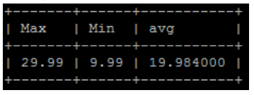

# Joins Exercise 5‐2

## Using Sakila database - Checkpoint Lab

1. Get a list of all film titles and their inventory number – even those we don’t have.
   - You might like to limit the output to 200 to check you have everything looking like this



```sql
SELECT f.title AS title, i.inventory_id
FROM inventory i
RIGHT JOIN film f
ON f.film_id = i.film_id
LIMIT 200;
```

2. Which films do we not have in stock?
   - There are 42 records beginning with:



```sql
SELECT DISTINCT f.title
FROM film f
LEFT JOIN inventory i
ON f.film_id = i.inventory_id
WHERE i.inventory_id IN
(SELECT r.inventory_id
FROM rental r
WHERE r.rental_date
);
LEFT JOIN rental r
ON i.inventory_id = r.inventory_id
WHERE i.inventory_id NOT IN r.inventory_id;
from rental r where r.rental_date IS NOT NULL;
```

3. List the number of films in which each actor has featured (sort the output in descending order of the number of films)



```sql
SELECT a.first_name, a.last_name, COUNT(f.title) AS Title_Count
FROM actor a
LEFT JOIN film_actor fa
ON a.actor_id = fa.actor_id
LEFT JOIN film f
ON fa.film_id = f.film_id
GROUP BY a.actor_id
ORDER BY Title_Count DESC;
```

### Techniques from this week

4. The store uses a formula to calculate the return‐on‐investment (or ROI) which is (rental_rate / replacement_cost \* 100).
   - List the films, rental replacement cost and ROI which have an ROI more than 10. Order by ROI. _Only have the formula once in the query_



```sql
SELECT f.title, f.replacement_cost, f.rental_rate,
f.rental_rate / f.replacement_cost * 100 AS ROI
FROM film f
GROUP BY f.title
HAVING ROI > 10.0
ORDER BY ROI;
```

5.  List the maximum, minimum and average film replacement cost using subselects in the select clause only (do not use a FROM clause in the main query) – yes this is silly.



```sql
SELECT
(
   SELECT MAX(fi.replacement_cost)
   FROM film fi
) max_cost,
(
   SELECT MIN(fi.replacement_cost)
   FROM film fi
) min_cost,
(
   SELECT AVG(fi.replacement_cost)
   FROM film fi
) avg_cost;
```

## Student Database on SQLite

### Techniques from earlier this week Not trivial, you’ll have to work on these.

6. List the students as pairs who come from the same sized high school. Order by school size.
   - Only list one pair of each student e.g. if you have Alice and Bob in a record don’t also list Bob and Alice (unless they are different students – we have two different AMY’s).
   - Work through this in stages – removing redundant pairs is the last step. You might like to display more information while developing the query (e.g. sid)

```sql
SELECT * FROM Student
ORDER BY sizeHS;
```

7. List each student that has made an application and the number of ITP’s they have applied to.
   - This is a simple inner join but I did use something introduced in passing today to get this.

```sql

```

## Subqueries and Outer Joins

8. Which students have not applied anywhere?

```sql
SELECT sa.sID, sa.sName 
FROM student sa
LEFT JOIN apply ap
ON ap.sID = sa.sID
WHERE ap.sId IS NULL;
```

9. List a count of the number of applications made by each student

```sql
SELECT DISTINCT sa.sID, sa.sName, (
     SELECT COUNT(*)
     FROM apply ab
     WHERE ab.sid = ap.sid
   ) AS count 
FROM student sa
LEFT JOIN apply ap
ON ap.sID = sa.sID
ORDER BY count DESC;
```

10. List the number of institutions that each student has applied to:

```sql

```

11. How many students have applied to each institution?

```sql

```
